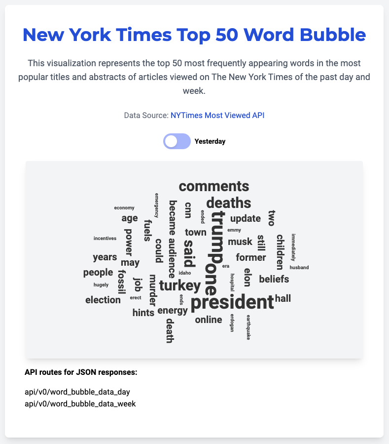

# New York Times Word Bubble Data



Data visualization web app using using New York Times API data, a word bubble of top 50 words appearing in the titles and abstracts of yesterday's or last week's most viewed articles.

## Features
- Flask
- NYT API
- SQLite with Flask-SQLAlchemy
- Tailwind CSS
- d3 javascript visualization library

Built with <3 following Miguel Grinberg's Flask course and book. 

# How to run the demo

## Tailwind CSS

npx tailwindcss -i ./flask_ML_template/static/css/style.css -o ./flask_ML_template/static/css/tailwind.css --watch

## Flask CLI

```
flask db init
flask db migrate 
flask db upgrade or flask upgrade
flask run --port 8080 --reload
```

You may also use 'flask shell' for interactive shell.

## Docker

```docker build -t nyt_word_bubble:test .```

```docker run --name nyt_word_bubble -d -p 8000:5000 nyt_word_bubble:test```

Inspect the images with
```docker images```

Delete the docker image with
```docker image rm nyt_word_bubble:test```

If your words aren't being loaded, make sure you have provided an API key.